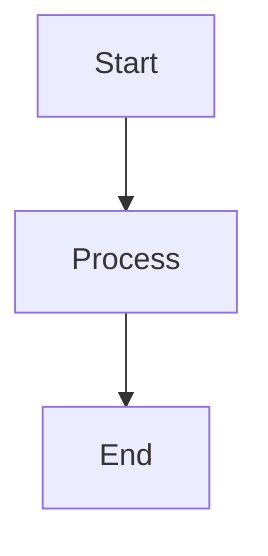

# Test Mermaid

This should render as a flowchart in the preview!

## 💡 **Pro Tips**

1. **Auto-reload**: The preview updates automatically as you type
2. **Zoom**: Use `Ctrl++` and `Ctrl+-` to zoom in/out of diagrams
3. **Export**: Some extensions allow exporting diagrams as images
4. **Syntax highlighting**: Mermaid syntax gets proper highlighting

## 🔍 **Troubleshooting**

If diagrams still don't render:
1. **Check extension status**: Ensure it's enabled
2. **Reload VS Code**: Sometimes needed after installation
3. **Check syntax**: Ensure proper `mermaid` code block syntax
4. **Update extension**: Make sure you have the latest version

The **"Markdown Preview Mermaid Support"** extension is your best bet for viewing the CrewAI architecture diagrams! 🎉